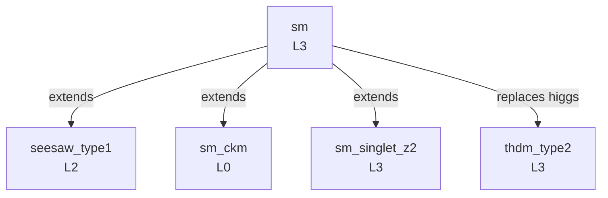

# Model genealogy

Generated by `scripts/build_genealogy.py` from `metadata.yaml → parents` only. Do not edit.

| id | name | parents | children | maturity |
|---|---|---|---|---|
| `seesaw_type1` | Type-I seesaw (SM + one right-handed neutrino with a Majorana mass) | sm (extends) | — | L2 |
| `sm` | Standard Model (one Higgs doublet, one full fermion generation) | — | seesaw_type1, sm_ckm, sm_singlet_z2, thdm_type2 | L3 |
| `sm_ckm` | Standard Model with three generations and CKM quark mixing | sm (extends) | — | L0 |
| `sm_singlet_z2` | SM + real singlet scalar (Z2-symmetric, spontaneously broken) | sm (extends) | — | L3 |
| `thdm_type2` | Two-Higgs-doublet model, type II, CP-conserving, softly broken Z2 | sm (replaces higgs) | — | L3 |
