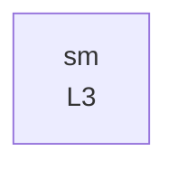

# Model genealogy

Generated by `scripts/build_genealogy.py` from `metadata.yaml → parents` only. Do not edit.

| id | name | parents | children | maturity |
|---|---|---|---|---|
| `sm` | Standard Model (one Higgs doublet, one full fermion generation) | — | — | L3 |
